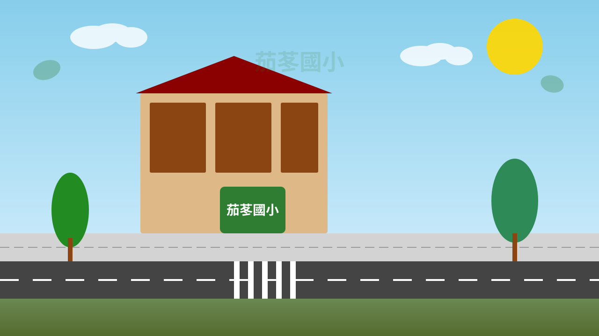

# 實況照片替換 SOP

> **Standard Operating Procedure**
> 給茄苳國小資訊組長 / 美術老師 / 家長會長,協助把 SVG 示意圖替換成真實照片。
> 不需要寫任何程式碼,跟著步驟做就好!

---

## 📋 為什麼要替換?

目前用的是 SVG 示意圖(通用卡通風格),但實際教學現場學生會更有共鳴:

- ✅ 看到熟悉的校門口 → 提升學習動機
- ✅ 看見自家校車 → 更認真記死角位置
- ✅ 看見每天走的路 → 與生活連結

**目標**:把所有 `*.svg` 場景背景替換成實況照片(壓縮到 < 200KB/張)。

---

## 📸 需要拍攝的照片清單

| 編號 | 檔名 | 內容 | 拍攝建議 |
|------|------|------|----------|
| P1 | `school-gate.jpg` | 茄苳國小校門口全景 | 早上 7:30 上學時段,有學生經過最好 |
| P2 | `road-to-school.jpg` | 校門口外道路 | 拍出車流與斑馬線 |
| P3 | `bus-stop.jpg` | 校車站牌特寫 | 拍出站牌 + 候車區 |
| P4 | `school-bus-front.jpg` | 校車正面 | 拍出車頭與死角範圍 |
| P5 | `school-bus-side.jpg` | 校車側面 | 拍出車身長度 |
| P6 | `bus-interior.jpg` | 校車車廂內部 | 拍出座位 + 走道 |
| P7 | `arrival-stop.jpg` | 下車站點 | 拍出下車位置與人行道 |
| P8 | `parent-meeting.jpg` | 家長接送區 | 拍出家長等小孩的畫面 |

---

## 🖼️ 照片處理規格

### 尺寸
- **寬度**:1920px(寬螢幕標準,Retina 屏也夠用)
- **高度**:1080px(16:9 比例,適配 CSS aspect-ratio)
- **解析度**:72 DPI(網頁用)

### 格式與大小
- **格式**:`.jpg` 或 `.webp`(不用 .png,太大)
- **品質**:`.jpg` 設 75-85%(肉眼看不出差異但檔案小很多)
- **單張大小**:目標 < 200KB(全部 8 張 = 1.6MB)

### 壓縮工具推薦
| 工具 | 平台 | 操作 |
|------|------|------|
| **Squoosh** (squoosh.app) | Web | 拖曳 → 選 JPEG75% → 下載 |
| **ImageOptim** | macOS | 拖入自動壓縮 |
| **TinyPNG** | Web | 拖入,免費 20 張/月 |
| **XnConvert** | Windows | 批次處理多張 |

---

## 🔄 替換步驟

### Step 1: 拍攝與挑選

1. 安排**早上 7:00-8:00** 到校門口拍攝(學生上學時段)
2. 拍攝**多角度**(正面 / 側面 / 細節),挑最清楚的一張
3. 注意:
   - 避免拍到學生臉部(個資法)
   - 拍到校車車牌可後製馬賽克
   - 早上下雨時拍攝效果佳(光線柔和)

### Step 2: 壓縮照片

把挑選的照片丟到 Squoosh:
1. 開啟 https://squoosh.app
2. 拖入照片
3. 右邊選 **JPEG** + **Quality 75**
4. Resize 寬度到 **1920**
5. 點右下「Download」

### Step 3: 命名檔案

按上方清單命名,改成 `.jpg`:

```
school-gate.jpg
road-to-school.jpg
bus-stop.jpg
school-bus-front.jpg
school-bus-side.jpg
bus-interior.jpg
arrival-stop.jpg
parent-meeting.jpg
```

### Step 4: 上傳到專案

把 `.jpg` 檔案放到這個資料夾:

```
qiedong-game/assets/images/photos/
```

(資料夾原本不存在,需要手動建立)

### Step 5: 修改引用

打開以下檔案,把 `.svg` 改成 `.jpg`:

| 檔案 | 改動位置 |
|------|----------|
| `js/scenes/IntroScene.js` | 校門口背景 |
| `js/scenes/MenuScene.js` | 校園背景 |
| `js/scenes/Level1Scene.js` | 道路背景 |
| `js/scenes/Level2Scene.js` | 站牌背景 |
| `js/scenes/Level3Scene.js` | 校車背景 |
| `js/scenes/Level4Scene.js` | 車廂背景 |
| `js/scenes/Level5Scene.js` | 到站背景 |
| `js/scenes/ParentScene.js` | 家長接送背景 |

**範例修改**:

```javascript
// 原本


// 改成

```

### Step 6: 刪除 SVG(選擇性)

如果確定不再用 SVG,可以把 `assets/images/bg/` 內對應檔案刪除以節省空間。

### Step 7: 測試

```bash
python3 -m http.server 8765
```
開啟 http://localhost:8765/,確認每個場景背景都正確顯示照片。

### Step 8: Commit + Push

```bash
git add assets/images/photos/
git commit -m "feat: 替換為茄苳國小實況照片"
git push origin main
```

GitHub Pages 會自動部署,5 分鐘後新版本上線!

---

## ⚠️ 注意事項

### 個資保護(重要!)
- ❌ 不要拍到學生臉部特寫
- ❌ 不要拍到學生家長清楚車牌
- ❌ 不要拍到學生家長肖像
- ✅ 拍攝背影、側面、群體(臉部模糊可接受)
- ✅ 拍攝校車與環境,不對學生

### 著作權
- 照片版權歸拍攝者(通常是學校),授權 MIT 給本專案使用
- 放上 GitHub 等同公開,請確認家長同意

### 檔案大小監控
```bash
du -sh assets/images/photos/
```
若超過 2MB,要再壓縮。目標是網頁載入 < 3 秒。

---

## 🆘 遇到問題?

### 照片模糊不清
→ 重新拍攝,或在 Photoshop 加銳利化濾鏡

### 照片顏色怪怪的(sRGB 問題)
→ 確保照片用 sRGB 色域,不要用 Adobe RGB

### 某些瀏覽器顯示不出來
→ 檢查檔案大小寫是否正確(Linux 區分大小寫)

### 照片太暗看不清楚
→ 加一層半透明白色 overlay,提升可讀性
```css
.scene-background::after {
    content: '';
    position: absolute;
    top: 0; left: 0; right: 0; bottom: 0;
    background: rgba(255, 255, 255, 0.15);
}
```

---

## 📝 版本紀錄

| 日期 | 改動 | 拍攝者 |
|------|------|--------|
| 2026-09-19 | 初版 SOP 撰寫 | 開發者 |
| YYYY-MM-DD | 第一次實況照片替換 | 待填 |
| YYYY-MM-DD | 校車照片更新 | 待填 |

完成替換後請更新此表格並 commit!